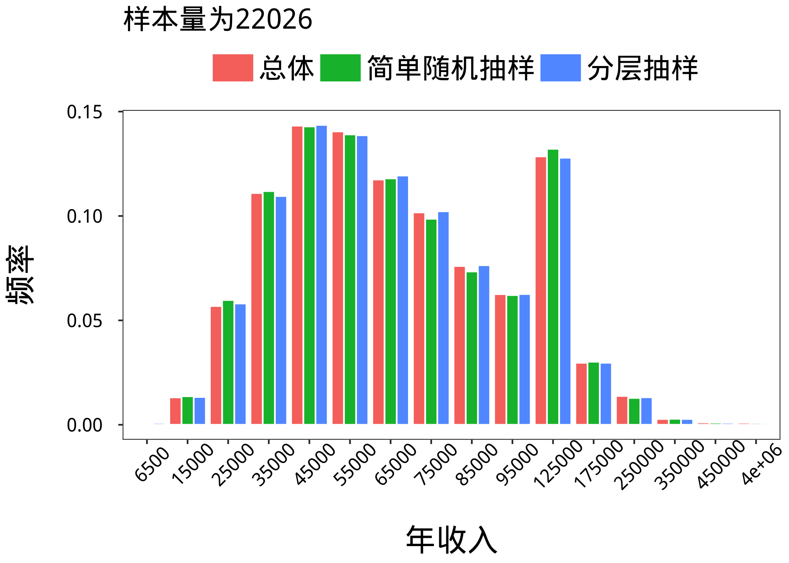

# 用R比较简单随机抽样和分层抽样的样本质量

## 1.样本质量

如何衡量样本质量呢？一种基本的想法是，如果样本和总体的相似度越高，样本质量就越好。换而言之，如果样本的分布和总体的分布相似度越高，那么样本质量就越好。Kullback-Laible 信息量可以衡量相同事件空间里两个概率分布的差异情况，因此，我们可以基于 Kullback-Laible 信息量来定义样本质量。

对于离散类型的数据，Kullback-Laible 信息量是这样定义的：
$$I(p,q)=\sum_{i}^{n}(p_i-q_i) \times log(\frac{p_i}{q_i})$$

其中，$p_i$表示第i类在总体中的概率，$q_i$表示第i类在样本中的概率。易知，如果样本分布和总体分布越类似，K-L信息量就越小，如果样本分布和总体分布差别越大，K-L信息量就越大。但是，上述定义存在一个问题，如果在少数类中抽样为0，那么上述定义的I值就会膨胀到无穷大，为了避免在这种情况的出现，我们会在计算$p_i$时加上一个很小的数（如：$1 \times 10^{-9}$）。在解决上述问题之后，$I(p,q)$的取值范围是0到1。如果I越接近0，表示样本越能代表总体，如果I越接近1，表示样本越不能代表总体。

在实际应用中，样本质量的定义方法为：
$$Q(p,q)=e^{-I(p,q)}$$

易知，Q的取值范围是0到1，如果Q越大，那么样本质量就越高。如果是连续型的数据，一种较为粗糙的办法是：先把原始数据合理分组，然后再按照离散型数据的方法处理。在本文中，我采取的就是这一种方法。

上述过程在R中实现的方法为：

```R
  I=sum((zt_fz$Freq2-s_fz$Freq2)*log(zt_fz$Freq2/s_fz$Freq2))
  Q=exp(-I)
```

 ## 2.总体

总体数据来源于贷款数据中的年收入数据，原始数据的基本结果如下表：

 变量|平均数 | 中位数 | 标准差 | 25%分位点 | 75%分位点 | 数据量
----|------| ------|-------|----------|----------|------
年收入|74850|65000 |55547.53|45380|90000|235629

我把数据分成了16组，分组后的情况如下：

  分组 | 频数 | 分组 | 频数
  ----|------|-----|----
  (3e+03,1e+04] | 159 | (1e+04,2e+04] | 3088
  (2e+04,3e+04] | 13402 | (3e+04,4e+04] | 26150
  (4e+04,5e+04] | 33754 | (5e+04,6e+04] | 33105
  (6e+04,7e+04] | 27676 | (7e+04,8e+04] | 23963
  (8e+04,9e+04] | 17916 | (9e+04,1e+05] | 14742
  (1e+05,1.5e+05] | 30286 | (1.5e+05,2e+05] | 6994
  (2e+05,3e+05] | 3252 | (3e+05,4e+05] | 650
  (4e+05,5e+05] | 261 | (5e+05,7.5e+06] | 230

分组绘图的情况：


在后文中，我将依据以上分组计算样本质量，在第三部分的分层抽样中，我将依据以上分组对总体进行分层抽样。上述过程实现的代码如下：

```R
  cut=c(min(annual_inc),
        (1:10)*10000,150000,(2:5)*100000,
        max(annual_inc))
  zt=data.frame(annual_inc=annual_inc,
                         fenzu=cut(annual_inc,breaks=cut))
  zt=na.omit(zt)
  zt$rowname=as.integer(row.names(zt))
  n=nrow(zt)
  zt_fz=data.frame(table(zt$fenzu))
```

## 3.简单随机抽样和分层抽样

### 3.1 确定样本容量

我使用指数函数的方式来生成样本容量，这样做可以保证在样本容量比较小的时候抽样更加密集而在样本容量比较大的时候抽样比较稀疏。我确定样本个数的代码如下：

```R
  x=seq(6,10,length=40)
  m=round(exp(x),0）
```

最后生成的40组样本容量情况如下：

```R
403    447   495   549   608   674   746   827   916  1015
1125  1247 1381  1530  1696  1879  2082  2307  2556  2832
3138  3477  3852  4268 4729  5240  5806  6433  7128  7898
8751  9696 10743 11904 13190 14614 16193 17942 19879 22026
```

### 3.2 简单随机抽样并计算样本质量

在简单随机抽样中，每一个样本入样概率应该相等，所以直接使用R中的sample函数，规定prob参数为NULL(默认)就可以实现等概率的简单随机抽样。

首先，我写了一个抽样函数fun，该函数输入样本容量x，输出已经分组统计好的样本s2，以及样本质量Q。该函数如下：

```R
  fun1=function(x){
    index=sample(zt$rowname,x)
    s=zt[index,]
    s_fz=data.frame(table(s$fenzu))
    s_fz$Freq2=s_fz$Freq/sum(s_fz$Freq)+0.0000000001
    I=sum((zt_fz$Freq2-s_fz$Freq2)*
           log(zt_fz$Freq2/s_fz$Freq2))
    Q=exp(-I)
    return(list(s_fz=s_fz,Q=Q))}
```

然后，我使用apply函数对一开始生成的样本容量m中的每一个值都进行了一次抽样，抽样的代码如下：

```R
  result=apply(as.matrix(m),1,fun1)
  Q=rep(NA,40)
  for(i in 1:40) Q[i]=result[[i]]$Q
```

### 3.3 分层抽样并计算样本质量

分层抽样的思路是，在抽样之前事先知道总体具有的分层结构，然后依据每层的个数按比例抽取。所以我应该事先计算出每一层中需要抽取的样本个数，然后用sample函数在每一层中分别抽取，再将分别抽取的样本合并。

首先，我写了一个抽样函数fun2，该函数输入样本容量x，输出已经分组统计过的总体s2和样本质量Q。抽样函数如下：

```R
  fun2=function(x){
    m1=round(zt_fz$Freq2*x,0)
    index=unlist(apply(cbind(c(1:16),m1),1,
                       function(x){
                         sample(zt$rowname[zt$fenzu==
                           zt_fz$Var1[x[1]]],x[2])}))
    s=zt[index,]
    s_fz=data.frame(table(s$fenzu))
    s_fz$Freq2=s_fz$Freq/sum(s_fz$Freq)+0.0000000001
    I=sum((zt_fz$Freq2-s_fz$Freq2)*
           log(zt_fz$Freq2/s_fz$Freq2))
    Q=exp(-I)
    return(list(s_fz=s_fz,Q=Q))}
```

然后，我使用apply函数对一开始生成的样本容量m中的每一个值都进行了一次抽样，抽样的代码如下：

```R
  result=apply(as.matrix(m),1,fun2)
  Q=rep(NA,40)
  for(i in 1:40) Q[i]=result[[i]]$Q
```

## 4.比较两种抽样方式的样本质量

我将两种抽样方式的样本质量和样本容量在同一张图上画出来之后的情况如下：


分层抽样的样本质量以更大的概率优于简单随机抽样的样本质量。这样的现象在样本容量较小的情况下表现得更加突出。

## 5.附录

### 5.1 随机种子

在本文中，如果设定不同的随机种子，结果将出现略微差别。正文中的随机种子设定为1.我将随机种子设定为1到4分别运行了一遍，结果如下：


在不同的随机种子设定下，分层抽样的样本质量都以更大的概率优于简单随机抽样的样本质量。

### 5.2 可视化

随着样本容量的增加，样本和总体的分布越来越接近。且从直观上看来，分层抽样和总体的相似程度更大。



